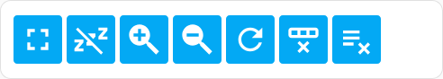
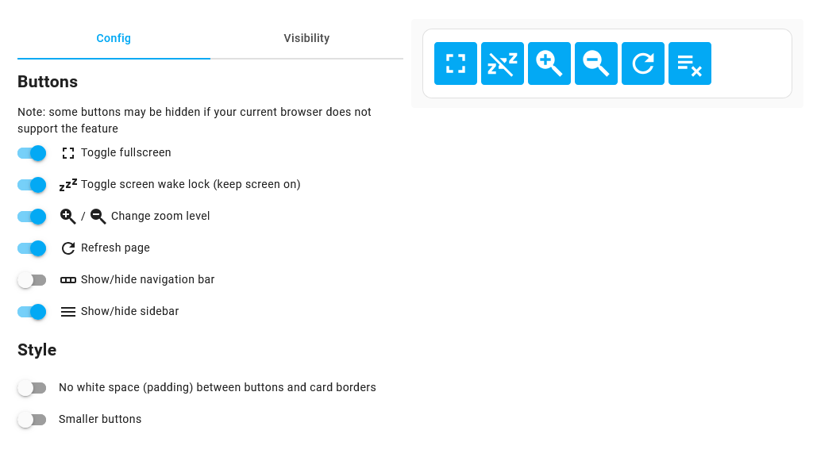

# Browser Control card

[](https://hacs.xyz/)   

Control your web browser from a [Home Assistant dashboard card](https://www.home-assistant.io/dashboards/cards/): full screen, disable screen lock, zoom...



This card is compatible with all web browsers and is particularly useful for:

* mobile devices
* devices with "locked" browser (browser in kiosk mode, without user menu/commands...) like the Facebook/Meta Portal

HomeAssistant controls also available: show/hide navigation bar & sidebar  
Changes are not persisted: reload the page to revert to initial settings

## Available controls

> [!NOTE]
> Some controls may be hidden if your browser does not support them

| Icon                                                                   | Control                                                   | Config. option           | Availability                                                                                                                                                                                                    |
|------------------------------------------------------------------------|-----------------------------------------------------------|--------------------------|-----------------------------------------------------------------------------------------------------------------------------------------------------------------------------------------------------------------|
|                                | Enter / exit full-screen                                  | `controls: [fullscreen]` | [](https://caniuse.com/mdn-api_element_requestfullscreen)       |
|                                   | Enable / disable screen wake lock (keep screen always on) | `controls: [wakelock]`   | [](https://caniuse.com/wake-lock)                               |
|   | Zoom in / zoom out (using CSS)                            | `controls: [zoom]`       | [](https://caniuse.com/css-zoom)                                |
|                                         | Reload page                                               | `controls: [reload]`     | [](https://caniuse.com/mdn-api_location_reload)                 |
|                       | Hide navigation bar                                       | `controls: [navbar]`     | [](https://caniuse.com/mdn-api_cssstyledeclaration_setproperty) |
|                             | Hide sidebar                                              | `controls: [sidebar]`    | [](https://caniuse.com/mdn-api_cssstyledeclaration_setproperty) |

### What is my browser?

If you cannot identify the browser your device is using, browse the following website <https://www.whatsmyua.info/>  
Search the result for a string like `Chrome/92.0`

## Styling options

* **Layout**: buttons horizontal alignment and spacing. Select between `center` (default), `space-around`, `left` and `right`

|  |  |
|-------------------------------------------------|-------------------------------------------------------|
| `center` layout                                 | `space-around` layout                                 |

* **No Padding**: remove space between buttons and card border
* **Small buttons** (button size is based on theme font size)

## Card configuration

The card can be configured directly from Home Assistant UI:



YAML configuration is also supported:

```yaml
type: custom:browser-control-card
controls:
  - fullscreen
  - wakelock
  - zoom
  - reload
  - navbar
  - sidebar
no_padding: false
small_buttons: false
layout: center
```

> [!NOTE]
> Old configuration keys beginning with `hide_` are still supported but will be ignored as soon as the card is configured using UI.

## Install the card

### Using HACS (recommended)

1. Make sure [HACS](https://hacs.xyz/) is installed.
2. On HACS interface, search and install "Browser Control Card"
3. Add the card to your dashboard and configure it

### Manual install

1. Copy `browser-control-card.js` from this repository to your HomeAssistant configuration folder `config/www/`  
2. Go to HomeAssistant configuration page > Dashboards > Three-dots "Resources" option in upper-right corner
3. Add resource `/local/browser-control-card.js` (Resource type: JavaScript module)
4. Reload the HomeAssistant UI by flushing cache (Ctrl + F5)
5. Add the card to your dashboard and configure it

## Sources

Based on [KTibow/fullscreen-card](https://github.com/KTibow/fullscreen-card) for card design and full screen  
Wake lock part from <https://web.dev/wakelock>
